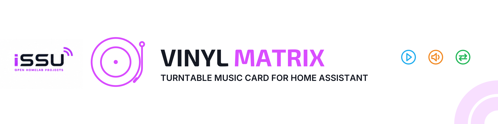
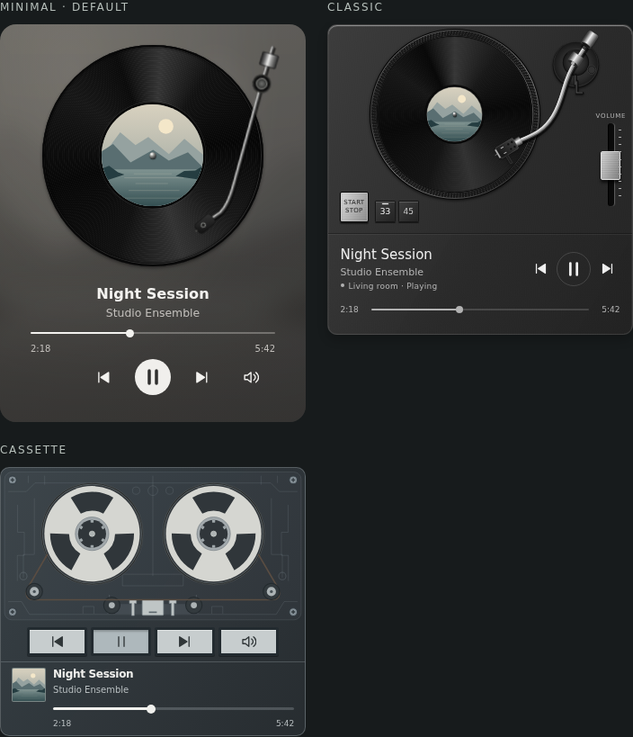
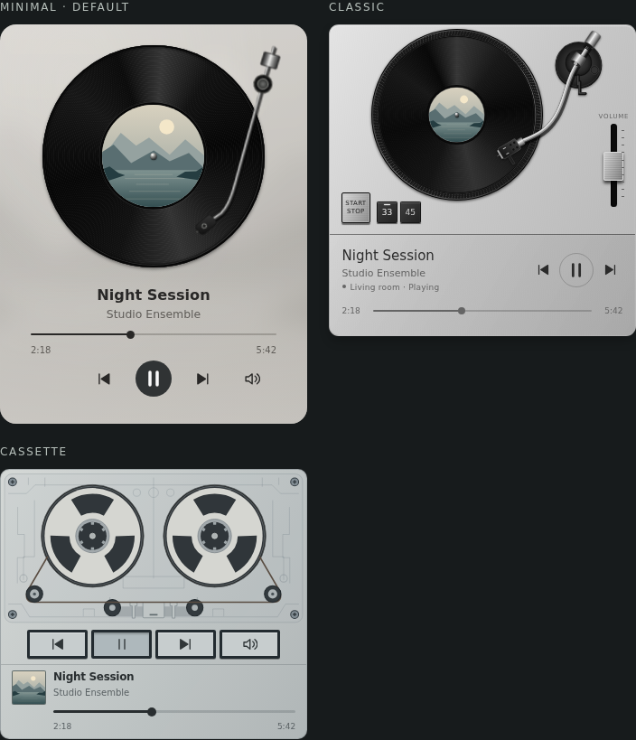
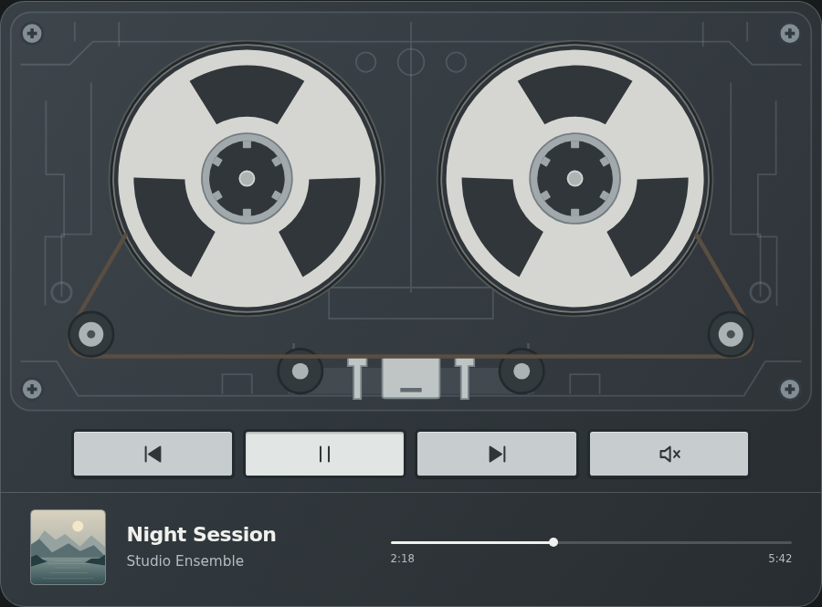

<div align="center">

[](#project-status)
[](https://www.home-assistant.io/)
[](#installation)
[](LICENSE)

**A turntable and cassette music card for Home Assistant.**

VinylMatrix brings album artwork and animated turntable or cassette mechanisms to your dashboard. Configure your media players once; the card follows the one that is playing.

</div>

---

## Project Status

| Field | Current state |
|---|---|
| **Maturity** | 🔵 Experimental |
| **Used in my homelab** | ❌ Not yet — simulated players only |
| **Recommended for production** | ❌ Not yet |
| **Setup difficulty** | 🟡 Intermediate — HACS custom repository |
| **Documentation** | ✅ Installation, configuration and development |
| **Current version** | `0.4.0` — experimental ([release](https://github.com/issu-lab/vinylmatrix-card/releases/tag/v0.4.0)) |
| **Validation** | 13 logic tests, 5 documentation checks, 15 Chromium scenarios, 12 WebKit layout checks and tonearm/Cassette checks in both engines ([GitHub checks](https://github.com/issu-lab/vinylmatrix-card/actions), including HACS validation) |
| **Distribution** | HACS custom repository (not in the default catalog) |

> [!WARNING]
> This project is experimental. The current version has been tested with simulated players, but has not been validated in a live Home Assistant instance. It is not recommended for production use yet.

---

## Why It Exists

Music deserves a recognizable place on a dashboard. VinylMatrix combines the familiar movement of a record player with a compact interface that puts album artwork first.

It works with existing Home Assistant media players, keeping the same experience across different devices and music integrations.

---

## Features

- 🎵 Album artwork, track title, artist and active player.
- 🔄 Automatic selection from an ordered list of media players.
- 💿 Rotating record and a tonearm that follows track progress, returning to rest when playback stops or pauses.
- 🎛️ Play/pause, previous/next, volume and seeking when supported by the player.
- 📼 Transparent Cassette style with rotating reels, lifting playback heads and compact artwork/progress.
- 🎨 Three selectable styles with automatic, light and dark colors.
- 🖱️ Visual configuration editor and YAML support.
- 🌍 English and Italian, with automatic language selection.
- ♿ Keyboard controls, accessible labels and reduced-motion support.

The card is standalone: it does not require other custom cards, external fonts or a separate music provider account.

---

## How It Works

The playing player takes priority. If several players are playing, VinylMatrix keeps the one already displayed; on first load, the first playing entry in the configured list wins.

When nobody is playing, the last available player remains visible so its artwork and resume control stay accessible. If that player becomes unavailable, the card falls back to the first available configured entry. If all are unavailable, it shows an unavailable state.

The record rotates only during `playing`. In both Minimal and Classic, the arm gradually moves from the outer grooves toward the label as the track advances, stopping short of the artwork. It follows position updates after seeking and the selected player when playback changes devices. Radio streams or tracks without a usable duration/position keep a fixed playing position.

The arm returns to its support during pause, idle, buffering or unavailability. Reduced motion disables spinning and makes the arm change position without animation.

In Cassette, both reels rotate while playing and the playback heads rise to the tape. Pause, stop, buffering and unavailable states stop the reels and lower the heads. Reduced motion disables reel rotation and makes the heads move instantly. The four rectangular buttons control previous track, play/pause (or stop when supported instead), next track and volume.

Selection itself sends no commands. Playback controls target the displayed entity, and a seek or volume gesture is canceled if the active player changes. Seeking is also canceled when the track changes.

---

## Interface

These screenshots show the actual card with original sample artwork and simulated entities.



| Style | Appearance |
|---|---|
| **Minimal** — default | Reference-matched record (72.3% of card width), artwork at 46% of the record diameter, curved metal arm, centered metadata and horizontal progress. The speaker button opens volume. |
| **Classic** | Graphite or silver turntable base, dotted platter rim, S-shaped metal arm, Start/Stop button, vertical volume and a lower strip for track information and playback controls. |
| **Cassette** | Flat transparent shell with two exposed reels and lifting heads, four rectangular keys and small artwork/seek controls beneath. Available in graphite and light neutral colors. |





---

## Installation

### HACS

With HACS installed, use this button to open the repository in your Home Assistant instance:

<div align="center">

[](https://my.home-assistant.io/redirect/hacs_repository/?owner=issu-lab&repository=vinylmatrix-card&category=plugin)

</div>

The button opens the HACS repository page; confirm the download there. VinylMatrix is a dashboard card, so no integration needs to be added under Devices & services.

If the repository is not found, add it manually:

1. Open **HACS → ⋮ → Custom repositories** ([HACS instructions](https://www.hacs.xyz/docs/faq/custom_repositories/)).
2. Enter `https://github.com/issu-lab/vinylmatrix-card` and select **Dashboard** as the category.
3. Find **VinylMatrix Card** in HACS, open it and choose **Download**.
4. Refresh the browser, edit a dashboard and choose **Add card → VinylMatrix Card**.
5. Select your media players and preferred style.

If the card is not listed, check that `/hacsfiles/vinylmatrix-card/vinylmatrix-card.js` is registered as a dashboard resource of type **JavaScript module**.

This repository is distributed as a custom HACS repository. It is not included in the default HACS catalog.

### Manual installation

Download `vinylmatrix-card.js` from the [latest release](https://github.com/issu-lab/vinylmatrix-card/releases/latest), or build it from source:

1. Copy `vinylmatrix-card.js` (or `dist/vinylmatrix-card.js` after a local build) to Home Assistant's `www/` directory.
2. Add `/local/vinylmatrix-card.js` as a dashboard resource with type **JavaScript module**.
3. Refresh the browser, edit a dashboard and choose **Add card → VinylMatrix Card**.
4. Select your media players and preferred style in the visual editor.

Keep a copy of the dashboard configuration and any previous resource before replacing them. Restore those copies to roll back.

---

## Configuration

```yaml
type: custom:vinylmatrix-card
entities:
  - media_player.living_room
  - media_player.office
theme: minimal
color_mode: auto
language: auto
```

| Option | Default | Purpose |
|---|---|---|
| `entities` | Required unless `entity` is used | Ordered list of media player entity IDs. |
| `entity` | — | Single-player shorthand. `entities` takes precedence if both are present. |
| `name` | Player's friendly name | Optional player label; the track title stays separate. |
| `theme` | `minimal` | `minimal`, `classic` or `cassette`. |
| `color_mode` | `auto` | Follow Home Assistant, or force `light` / `dark`. |
| `language` | `auto` | Follow Home Assistant, or choose `en` / `it`. Other languages fall back to English. |

In the visual editor, search for a media player by friendly name or entity ID. Only `media_player` entities are offered; players already selected in another row are excluded. The row order defines startup priority.

Choose **Cassette** in the visual editor, or set `theme: cassette` in YAML. Minimal remains the default for existing and new configurations.

Classic’s 33/45 buttons change the record animation speed only. They do not change the playback speed of your audio.

Configurations saved with the retired `vinyl` or `ambient` style open Minimal automatically.

For a single player:

```yaml
type: custom:vinylmatrix-card
entity: media_player.living_room
```

---

## Known Limitations

- Live Home Assistant validation is still pending. Distribution through a custom repository does not imply acceptance into the default HACS catalog.
- Browser scenarios run in Chromium, with additional Minimal layout checks in WebKit and shared tonearm/Cassette geometry, playback and motion checks in both engines. Validation on physical mobile devices and across Home Assistant versions remains pending.
- Available controls depend on the features reported by the selected player. Unsupported controls are disabled.
- Live streams without a finite duration cannot seek. Missing duration or position is displayed as `—:—`.
- Unavailable cover images use a built-in placeholder. Artwork URLs are supplied by the media player integration.
- Commands sent to a grouped player may affect its group, according to the integration's behavior.
- Music search, library browsing, playlists, an equalizer and audio analysis are outside the initial scope.

---

## Documentation

- [Development, architecture and validation](docs/development.md)
- [Branding sources and regeneration](source/README.md)
- [Roadmap](ROADMAP.md)
- [Changelog](CHANGELOG.md)

---

## License

Released under the [MIT License](LICENSE).

---

<div align="center">

This project is part of the **iSSU Open Homelab ecosystem**.

<a href="https://github.com/issu-lab/Open-Homelab">
  
</a>

</div>
